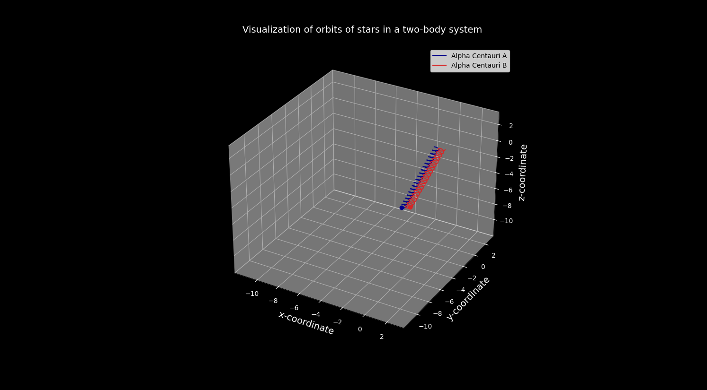
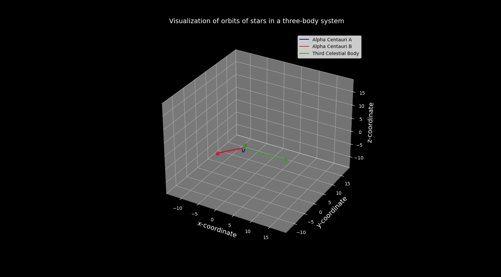

Title: The Cosmic Ballet: Simulating the Three-Body Problem

# Introduction
Get ready to explore the wonders of the cosmos!  From the predictable dance of planets around a star to the intricate interactions of multiple stars,  celestial motion has captivated us for centuries. In this project, we'll use Python to simulate these beautiful orbits, learning about the physics behind them and the joy of coding along the way.

# My Motivation
- The Universe is Awesome: I want to understand the forces that shape the motion of stars and planets. It's incredible!
- Coding is Fun: Translating physics into code is a rewarding challenge, especially when it creates stunning visuals.
- Sharing the Excitement: This project is for everyone curious about the cosmos and those who want to discover the fun side of Python programming.

## Let's introduce the tools of the trade:
- NumPy: Our powerful number-crunching library for calculations.
- Matplotlib: The artist that paints beautiful orbits and animations.
- SciPy: Specifically the ODE solver, it solves the complex equations of motion.
- Pillow: Turns our cosmic ballet into a GIF to share the wonder.

## The Physics: Newton's Universal Law of Gravitation
At the heart of our simulation lies Newton's Law of Gravitation. This equation describes the attractive force between any two objects with mass:
F = G * (m1 * m2) / r**2

F: Force of gravity
G: The universal gravitational constant
m1, m2: Masses of the two objects
r: Distance between the objects
The Equations of Motion

## To predict the stars' trajectories, we need equations that describe how their positions and velocities change over time. These involve some calculus, but the core idea is:
- We calculate the gravitational forces between each pair of stars.
- These forces cause acceleration (changes in velocity).
- The velocities determine how the positions change.

# The Code

## Let's do a quick walkthrough:
1. Constants and Initial Conditions: We start by defining things like the gravitational constant, masses, and starting positions for stars and planets. Feel free to experiment!
2. Equations of Motion: These functions calculate the forces and how they change the positions and velocities of celestial bodies.
3. ODE Solver: SciPy does the heavy lifting, solving our complex equations.
4. Visualization: Matplotlib creates eye-catching plots and animations. Look for lines tracing orbits and markers as stars!

## Running the Simulation
Two-Body System (Alpha Centauri A and Alpha Centauri B):Let's start simple! We'll simulate the familiar Earth-Sun orbit.

Three-Body System (Stars Dancing): Now, the intrigue! Watch as three stars interact in surprising ways.

## The Challenge and the Beauty
Even simple systems can create unexpected patterns!  Small changes to the starting setup can drastically alter the long-term behavior of the orbits.  That's part of the magic of the universe

## Explore and Experiment!
- Change the starting positions and velocities of stars and planets. See what happens!
- Can you add more celestial bodies? What cool patterns could you create?
- Could you visualize the center of mass of the system?

# Credit
Thanks to the authur for this article to provide the code I have fun learning python.
https://towardsdatascience.com/modelling-the-three-body-problem-in-classical-mechanics-using-python-9dc270ad7767

Also thanks to my six-year-old son, Jordan, who is in love with Mathematics, Coding and Astronomy.