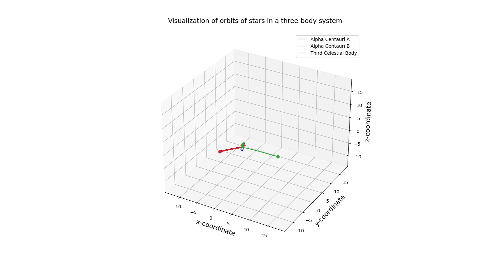

Title: The Cosmic Ballet: Simulating the Three-Body Problem

# Introduction

Have you ever wondered how the stars dance across the night sky? While two-body systems (like the Earth and Sun) have predictable orbits, add just one more star, and things get a whole lot more chaotic! This project dives into the fascinating physics of the three-body problem and uses Python to create a beautiful visualization of their intricate motions.

# My Motivation

This project was my way of exploring several things I'm passionate about:

- Python Programming: I wanted to practice my Python skills and learn how to use libraries like NumPy, Matplotlib, and SciPy for scientific simulations.
- The Physics of Motion: The three-body problem is a fantastic way to understand the principles of gravitation and how complex systems evolve over time.
- The Joy of Coding: There's a special satisfaction in taking mathematical concepts and translating them into a working simulation.

## Let's introduce the tools of the trade:

- NumPy: The foundation for numerical calculations in Python. We'll use it to handle arrays, mathematical operations, and more.
- Matplotlib: Our canvas for creating stunning plots and animations.
- SciPy: Specifically the scipy.integrate module, which houses powerful ODE (Ordinary Differential Equation) solvers.
- Pillow: Helps us save our stellar choreography as a GIF animation.
- The Physics: Newton's Universal Law of Gravitation

## At the heart of our simulation lies Newton's Law of Gravitation. This equation describes the attractive force between any two objects with mass:

F = G * (m1 * m2) / r**2
F: Force of gravity
G: The universal gravitational constant
m1, m2: Masses of the two objects
r: Distance between the objects
The Equations of Motion

## To predict the stars' trajectories, we need equations that describe how their positions and velocities change over time. These involve some calculus, but the core idea is:

- We calculate the gravitational forces between each pair of stars.
- These forces cause acceleration (changes in velocity).
- The velocities determine how the positions change.

# The Code

## Let's do a quick walkthrough:

1. Constants and Initial Conditions:  We set up things like the gravitational constant, masses of the stars, and their starting positions and velocities. Feel free to experiment with different starting scenarios!

2. Equations of Motion (ThreeBodyEquations Function): This is the brain of the simulation. It takes in the current state (positions and velocities) and spits out the changes for the next tiny time step.

3. ODE Solver:  SciPy's ODE solver is our numerical workhorse. It crunches the equations of motion, step by tiny step, to trace the paths of the stars.

4. Visualization:  Matplotlib lets us plot the orbits and create the animation. Lines represent the trails of the stars, and markers show their current positions.

## Running the Simulation

It's simple!  Just execute the Python script, and the animated dance of the three stars will appear before your eyes.  The three_body_simulation.gif will save the cosmic ballet for you to enjoy.

## The Challenge and the Beauty

The three-body problem is notoriously complex and often unpredictable. Small changes in the starting conditions can lead to wildly different outcomes over time. This is a testament to just how awe-inspiring and intricate our universe can be!

## Let's Explore!

- Try tweaking the initial positions or velocities of the stars. What happens?
- Could you add a fourth star and see how the system reacts?
- Think about how you might represent the center of mass of the system in the visualization.

# Credit
Thanks to the authur for this article to provide the code I have fun learning python.
https://towardsdatascience.com/modelling-the-three-body-problem-in-classical-mechanics-using-python-9dc270ad7767

Also thanks to my six-year-old son, Jordan, who is in love with Mathematics, Coding and Astronomy.